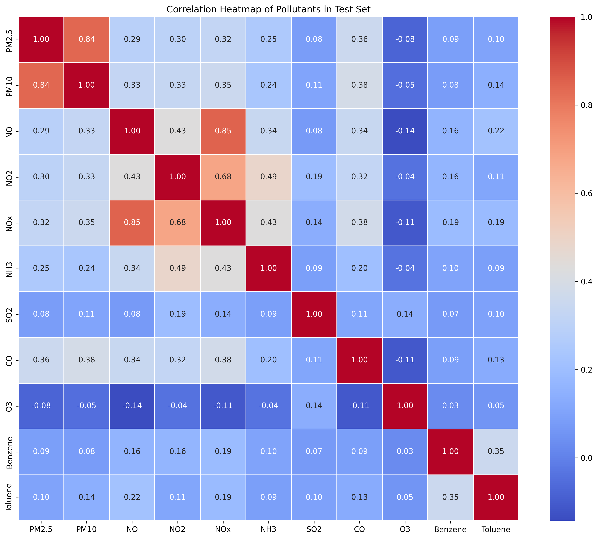
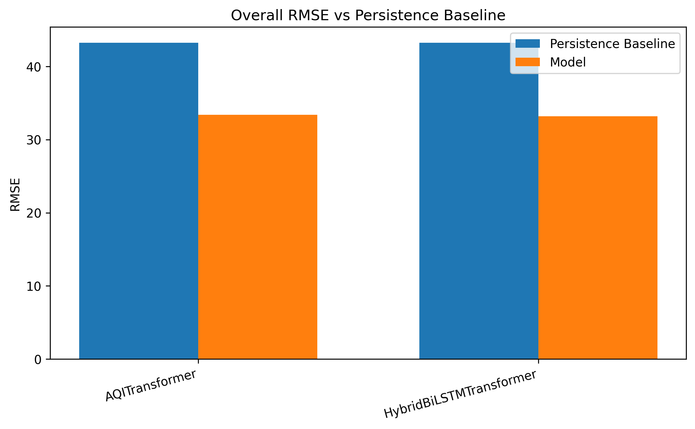
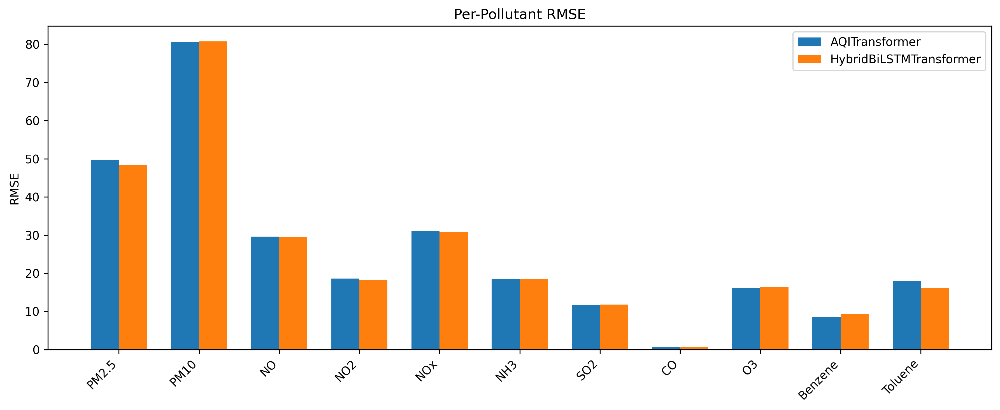

# AtmoSense-Seq-Forecast

AtmoSense-Seq-Forecast is a multi-pollutant air quality forecasting project using hourly India CPCB monitoring data. Given the past 72 hours of pollutant readings, the system forecasts the next 48 hours for 11 pollutants jointly.

The project compares two architectures:

- **AQITransformer**: an encoder-decoder Transformer for joint multi-pollutant forecasting
- **HybridBiLSTMTransformer**: a BiLSTM encoder with a Transformer decoder

Both models are evaluated against a persistence baseline, where the last observed value in the 72-hour input window is repeated for all 48 future forecast hours.

---

## Project Structure

```text
AtmoSense-Seq-Forecast/
├── src/              # Python source files
├── notebooks/        # Colab/Jupyter notebooks
├── results/          # Final evaluation metrics and figures
├── data/             # Dataset
├── README.md
└── requirements.txt
```

## Source Files

| File | Description |
|------|-------------|
| `src/dataset.py` | Data loading, quality filtering, interpolation, windowing |
| `src/model.py` | AQITransformer and HybridBiLSTMTransformer architectures |
| `src/train.py` | Training loop with warmup, early stopping, checkpointing |
| `src/evaluate.py` | Full-test evaluation with MAE, RMSE, R² metrics |

### Folder Descriptions

- `src/` — Python source files for data loading, model architecture, training, and evaluation.
- `notebooks/` — Colab/Jupyter notebooks for evaluation and reproducibility.
- `results/` — Final CSV metrics and report-ready plots.
- `data/` — Dataset instructions only. Raw data, checkpoints, scalers, and cached prediction arrays are stored externally in Google Drive.

---

## Requirements

Install the required packages using:

```bash
pip install -r requirements.txt
```

Recommended package versions:

```text
numpy==1.26.4
pandas==2.0.3
torch==2.1.0
scikit-learn==1.3.2
matplotlib==3.8.0
seaborn==0.13.0
joblib==1.3.2
tqdm==4.66.1
```

The project was developed using Google Colab (A100 GPU) and the UMD Zaratan HPC cluster.
All evaluation notebooks assume a Colab-style Google Drive mount path.
---

## Dataset

This project uses hourly air quality monitoring data from India's Central Pollution Control
Board (CPCB), sourced through the Kaggle dataset:

**Time Series Air Quality Data of India (2010–2023)**
https://www.kaggle.com/datasets/abhisheksjha/time-series-air-quality-data-of-india-2010-2023

Download the dataset from Kaggle and place all per-station CSV files in:

```text
/content/drive/MyDrive/AQI_Project/data/
```

The dataset covers 453 monitoring stations across India. After quality filtering, 351
stations are retained. The model uses 11 pollutant columns:

- PM2.5, PM10, NO, NO2, NOx, NH3, SO2, CO, O3, Benzene, Toluene

<p align="center">
  
</p>

The preprocessing pipeline:
1. Filters stations with more than 40% missing data
2. Drops pollutant columns with more than 50% missing values globally
3. Applies per-station linear interpolation (never across station boundaries)
4. Splits chronologically 70% / 15% / 15% by calendar date
5. Normalises using a single StandardScaler fitted on the training set only
6. Generates 72-hour input / 48-hour forecast sliding windows with stride 6

---
## Checkpoints and Cached Predictions

Trained model checkpoints, scalers, and cached full-test prediction arrays are not stored
in this GitHub repository due to file size limits. They are available in the shared Google
Drive folder:

**Shared Google Drive — AQI_Project:**
[Google Drive — AQI\_Project Shared Folder](https://drive.google.com/drive/folders/1FoA62gJLeSTH15AsRnVHR7pYGsUivXuP?usp=sharing)

Copy the entire `AQI_Project` folder to your own Google Drive before running any notebook.
The expected path inside Colab is:

```text
/content/drive/MyDrive/AQI_Project/
```

The folder contains:

```text
AQI_Project/
├── data/                    ← per-station CSV files
├── checkpoints/             ← AQITransformer best_model.pt and all_scaler.pkl
├── checkpoints_hybrid/      ← HybridBiLSTMTransformer best_model.pt and all_scaler.pkl
├── experiment_logs/         ← training_log.txt for both runs
└── final_results/           ← cached prediction arrays and evaluation CSVs
```

---

## Setup

Clone the repository:

```bash
git clone https://github.com/RithikaBaskaran/AtmoSense-Seq-Forecast.git
cd AtmoSense-Seq-Forecast
```

Install dependencies:

```bash
pip install -r requirements.txt
```

Open the evaluation notebook in Google Colab:

```text
notebooks/04_evaluation_plots.ipynb
```

Mount Google Drive when prompted by the notebook.

---

## Execution Steps

### Option 1: Reproduce Results from Cached Predictions

This is the recommended method for quick reproducibility.

1. Clone the repository.
2. Install requirements.
3. Copy the shared `AQI_Project` Google Drive folder to your own Drive.
4. Open `notebooks/final_full_set_evaluation.ipynb` in Google Colab.
5. Keep the evaluation flags as:

```python
RUN_FULL_AQI_EVAL = False
RUN_FULL_HYBRID_EVAL = False
```

6. Run all notebook cells.

This mode loads cached full-test predictions from Google Drive and regenerates:

- overall comparison tables
- per-pollutant metrics
- AQITransformer vs HybridBiLSTMTransformer comparison tables
- RMSE and MAE forecast-horizon plots
- final CSV files and PNG figures

### Option 2: Rerun Full Model Evaluation

Use this only if you want to regenerate predictions from the trained model checkpoints.

In the notebook, change:

```python
RUN_FULL_AQI_EVAL = True
RUN_FULL_HYBRID_EVAL = True
```

Then run all evaluation cells.

This will:

- load the trained checkpoints
- build the held-out test loader
- run full inference on 149,225 test samples
- inverse-scale predictions using the saved scalers
- recompute MAE, RMSE, MAPE, and R²
- overwrite cached evaluation results in Google Drive

---
## Training From Scratch

To retrain the AQITransformer on the full dataset, run:

```bash
python src/train.py \
    --data_dir /path/to/data \
    --checkpoint_dir /path/to/checkpoints \
    --d_model 128 --nhead 8 \
    --num_enc_layers 4 --num_dec_layers 4 \
    --dim_feedforward 512 \
    --epochs 100 --batch_size 64 \
    --tf_ratio 1.0 --patience 15 \
    --stride 6 --lr 5e-5
```

To train the HybridBiLSTMTransformer, add `--model hybrid` to the command above.

Training was conducted on UMD Zaratan HPC (A100 GPU) using SLURM.
AQITransformer: ~11.3 hours (52 epochs). Hybrid: ~9.4 hours (58 epochs).
---

## Final Results
### Overall RMSE vs Persistence Baseline

<p align="center">
  
</p>

### Per-Pollutant RMSE Comparison

<p align="center">
  
</p>

| Model | MAE | RMSE | R² | RMSE Improvement vs Baseline |
|---|---:|---:|---:|---:|
| Persistence Baseline | 16.05 | 43.23 | 0.6047 | -- |
| AQITransformer | 12.80 | 33.41 | 0.7639 | 22.71% |
| HybridBiLSTMTransformer | 12.96 | 33.19 | 0.7670 | 23.23% |

The HybridBiLSTMTransformer achieved the best overall RMSE and R². AQITransformer achieved slightly better MAE.

---

## Results and Figures

All final outputs are stored in:

```text
results/
├── metrics/      ← CSV files with MAE, RMSE, R², and improvement percentages
└── figures/      ← PNG plots for report and presentation
```

---

## Reproducibility Notes

The evaluation notebook supports two modes:

- **Cached mode**: loads saved full-test prediction arrays and regenerates results quickly.
- **Full inference mode**: reruns model inference from checkpoints and overwrites cached outputs.

For exact reproduction, use the shared Google Drive folder and keep the expected path:

```text
/content/drive/MyDrive/AQI_Project/
```

If using a different path, update the path constants in the notebook.

---

## Contributors

- **Murugavel Suresh** — Data preprocessing and dataset pipeline
- **Rithika Baskaran** — Model architecture
- **Sreya Datla** — Training pipeline and checkpointing
- **Ravi Vignesh** — Evaluation, metrics, visualizations, and final result analysis

---

## Citation

If you use this work, please cite:

```text
Suresh, M., Vignesh, R., Baskaran, R., & Datla, S. (2026).
AtmoSense-Seq-Forecast: Multi-Pollutant AQI Forecasting with a Seq2Seq Transformer.
Course Project, University of Maryland.
```
